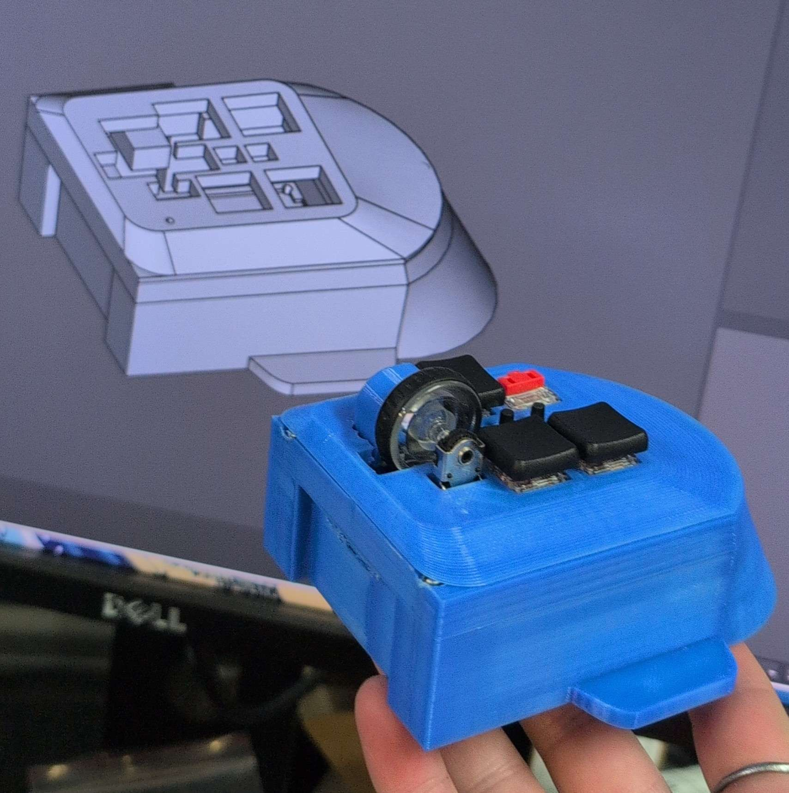

# Mase
 Custom esp32 mouse.
 
 |index|References|Value|Footprint|Quantity|
 |:-|:--------|:-|:--|:-|
|1| C101, C102, C106, C108, C110    |0.1u|C_0805_2012Metric|5|
|2| C103, C105, C107, C109, C111    |1u|C_0805_2012Metric|5|
|3| C104                            |4.7u|C_0805_2012Metric     |1|
|4| R102, R103, R104                |10k|R_0805_2012Metric|3|
|5| R107, R108, R109                |?|R_0805_2012Metric|3|
|6| R105, R106                      |R_1206|R_0805_2012Metric|2|
|7| R101|39|R_0805_2012Metric|1|
|8| D101, D102|LED_3mm|LED_D3.0mm|2|
|9| U1|ESP32-S3-WROOM-1|ESP32-S3-WROOM-1|1|
|10|U2|PMW3360|PMW3360|1|
|11|U4|	TLV73333PDBV|	SOT-23-5	|1|
|12|U103|	TCR2EF19|	SOT-23-5	|1|
|13|SW1, SW2|	Push_Button|	SW_Hotswap_Kailh_Choc_V1V2_1.00u	|2|
|14|SW101, SW104|	Push_Button|	SW_Micro_Switch	|2|
|15|SW103, SW106|	Push_Button|	SW_Push_1P1T_NO_CK_KSC7xxJ	|2|
|16|SW3|	RotaryEncoder_Switch_MP|	RollerEncoder_Panasonic_EVQWGD001	|1|
|17|	SW102|	Push_Button|Switch_Toggle_SPDT_SubMini	|1|
|18|TP101, TP102, TP103, TP104, TP105, TP106, TP107|TestPoint|TestPoint_Pad_D1.0mm|7|
|19|	H1, H2, H3, H4|	MountingHole|MountingHole_3.2mm_M3|4|
|20|	Brd101|	SSD1306|	128x64OLED	|1|
|21|	J1|	Conn_01x04|	PinHeader_1x04_P2.54mm_Vertical	|1|
|22|	J2|	Conn_02x04_Counter_Clockwise|IDC-Header_2x04_P2.54mm_Vertical|1|
|23|	J101|	Conn_02x03_Counter_Clockwise|	Harwin_Gecko-G125-FVX0605L0X_2x03_P1.25mm_Vertical	|1|
